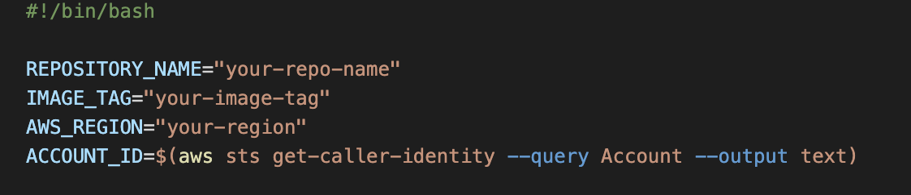
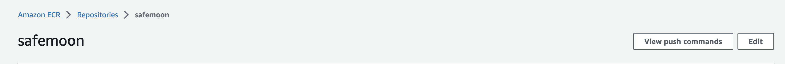
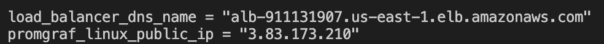
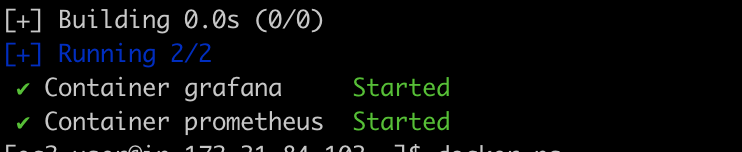
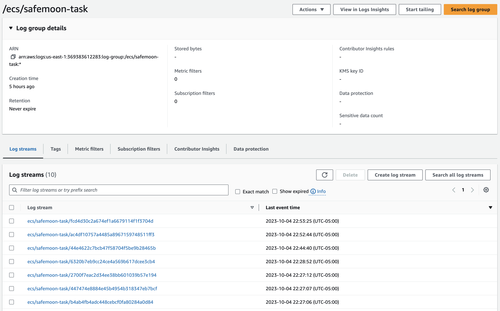
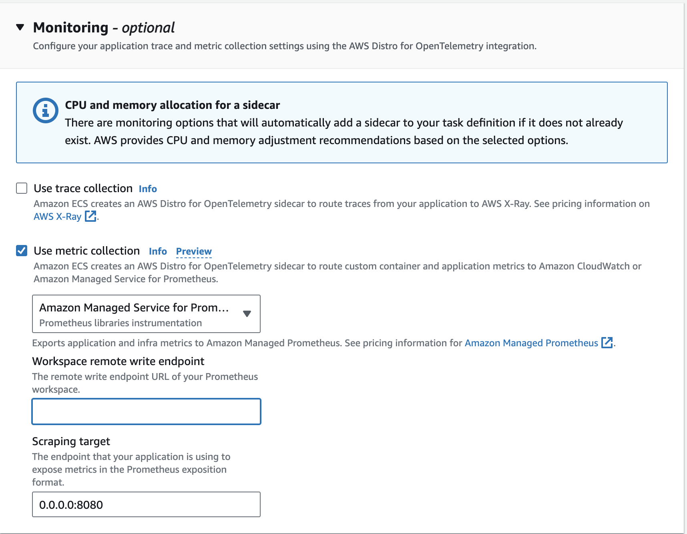
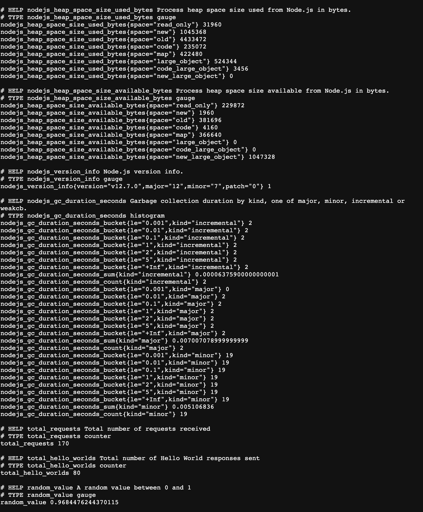
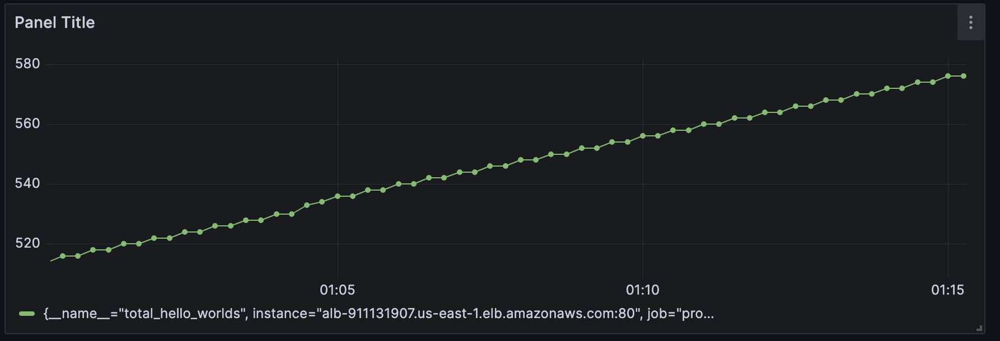
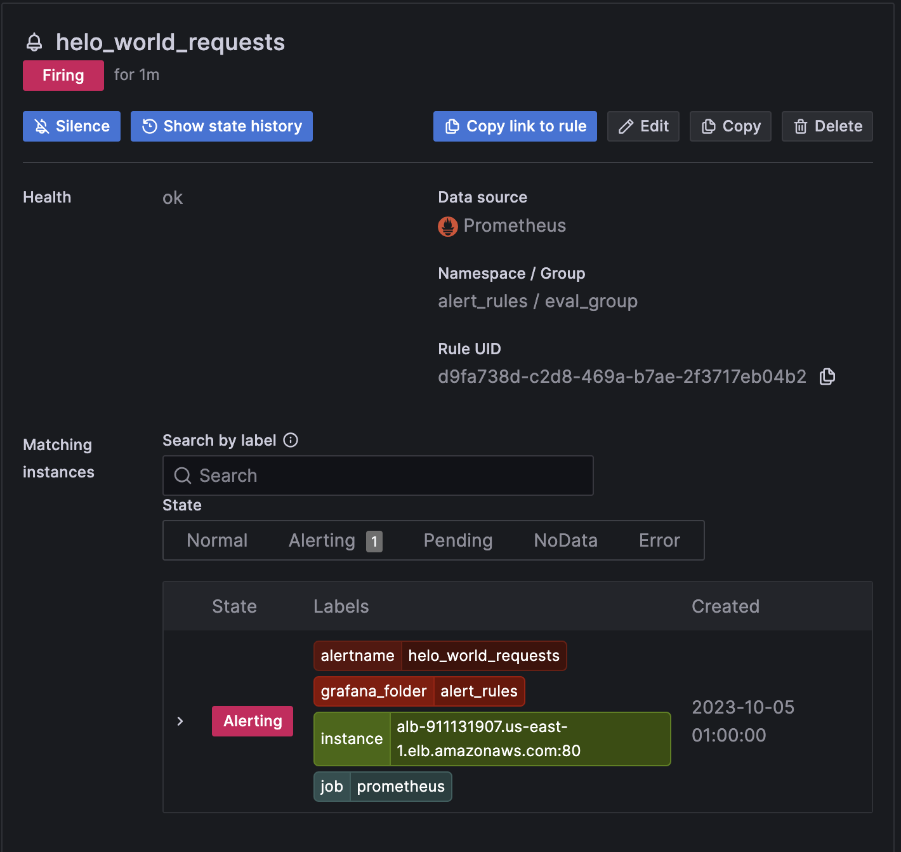

## Instructions:

*While I recognize that this might not be the optimal solution, it effectively serves as a valuable proof of concept (POC).*

**Technologies Used**:

- **Terraform**: Utilized for infrastructure-as-code deployment.
- **EC2**: Amazon Elastic Compute Cloud, offering scalable computing capacity.
- **Prometheus**: Open-source monitoring and alerting toolkit.
- **Grafana**: Open-source platform for monitoring and observability.
- **ECS**: Amazon Elastic Container Service, managing Docker containers at scale.
- **ECR**: Amazon Elastic Container Registry, storing Docker container images.
- **Docker**: Platform to develop, ship, and run applications inside containers.
- **Docker Compose**: Tool for defining and managing multi-container Docker applications.
- **Python**: Scripting for service discovery. <---> This was fun...

**Setup & Deployment**:

1. Adjust the variables to align with your specific objectives.

2. Execute the following commands sequentially:
   - `terraform init`
   - `terraform plan`
   - `terraform apply`

3. Navigate to the app folder: `cd app`

4. Execute `./push-to-ecr.sh` with your credentials.



This can also be done manually, utilizing the push commands.



Once done, access the application through the load balancer endpoint, available in the outputs inside of the terminal. It should present you with a "hello world" display.

Outputs:


**EC2 Configuration**:

The EC2 instance benefits from bootstrapping via user data. However, some manual interventions are essential:

1. Update the Prometheus configuration target using your load balancer endpoint. You can achieve this by revising the user data within the EC2 resource, replacing `<YOUR-LOAD-BALANCER-HERE>`.

2. Reapply Terraform: `terraform apply`

3. Post-configuration, Grafana can be accessed at `<EC2-Public-IP>:3000` and Prometheus at `<EC2-Public-IP>:9090`.

**Sidenote**: Multiple solutions exist for this configuration. However, to ensure clarity and employ minimal services and simplicity for this project, I opted for this particular approach.

**Sidenote Sidenote**: You may have to exec into the SSH into the instance and run `sudo docker-compose up` manually.



**Sidenote Sidenote Sidenote**: If you need further insights into your application, you can view the Cloudwatch logs:



---

## My Journey with the Project

The project was a roller coaster of learning experiences. Despite some initial missteps, it evolved into a valuable growth opportunity for me.

###  **Diving into Unknown Waters with AMP and ECS**
My journey commenced with research on implementing Prometheus in ECS using AMP—a tool I hadn't interfaced with before. Although scant and at times convoluted information was available, mostly oriented towards EKS and not ECS, it was crucial to stick to native resources, avoiding any makeshift solutions.

###  **The Overlooked Console Feature**
A recent, in-console ADOT task definition feature, could have streamlined my process. However, I only stumbled upon it post-completion.



###  **Embarking with Terraform**
With what appeared as the simpler tasks at hand, I delved into deploying an ECS cluster and task using Terraform. Despite being mostly boilerplate, it marked the initiation of the project's practical phase.

###  **Opting for a Simple JS Express App**
For full control and simplicity, I utilized a basic JavaScript Express app. This decision saved me from intricate configurations and metric adjustments.

###  **Metrics Collection: The Ups and Downs**
Beginning with default metrics was straightforward—integrate the Prometheus client and direct metrics to the `/metrics` endpoint. However, an oversight led me down a convoluted path of sidecars, erroneous node exporter metrics, and misinterpreted endpoints. The complexities even had me constructing a custom service discovery using Python and cronjobs—turns out, it wasn't necessary.

###  **Returning to Basics**
Removing the sidecar brought clarity. My understanding had been clouded by routing conflicts within the load balancer. Addressing it unlocked access to the metrics.



### 🌟 **The Final Steps: Prometheus and Terraform**
With metrics in hand, the subsequent tasks were simpler: set up a Prometheus instance and configure it for the load balancer. Leveraging Docker-compose, a consistent ally in my toolkit, I fashioned a promgraf stack—a helm chart equivalent in this context. With everything functional, all that remained was harnessing Terraform.

Examples:

**Graph**


**Alert**


**Plan**: 

```
Terraform used the selected providers to generate the following execution plan. Resource actions are indicated
with the following symbols:
  + create

Terraform will perform the following actions:

  # aws_alb.alb will be created
  + resource "aws_alb" "alb" {
      + arn                                         = (known after apply)
      + arn_suffix                                  = (known after apply)
      + desync_mitigation_mode                      = "defensive"
      + dns_name                                    = (known after apply)
      + drop_invalid_header_fields                  = false
      + enable_deletion_protection                  = false
      + enable_http2                                = true
      + enable_tls_version_and_cipher_suite_headers = false
      + enable_waf_fail_open                        = false
      + enable_xff_client_port                      = false
      + id                                          = (known after apply)
      + idle_timeout                                = 60
      + internal                                    = (known after apply)
      + ip_address_type                             = (known after apply)
      + load_balancer_type                          = "application"
      + name                                        = "alb"
      + preserve_host_header                        = false
      + security_groups                             = (known after apply)
      + subnets                                     = (known after apply)
      + tags_all                                    = (known after apply)
      + vpc_id                                      = (known after apply)
      + xff_header_processing_mode                  = "append"
      + zone_id                                     = (known after apply)
    }

  # aws_cloudwatch_log_group.app_log_group will be created
  + resource "aws_cloudwatch_log_group" "app_log_group" {
      + arn               = (known after apply)
      + id                = (known after apply)
      + name              = "/ecs/safemoon-task"
      + name_prefix       = (known after apply)
      + retention_in_days = 0
      + skip_destroy      = false
      + tags_all          = (known after apply)
    }

  # aws_default_subnet.default_subnet_a will be created
  + resource "aws_default_subnet" "default_subnet_a" {
      + arn                                            = (known after apply)
      + assign_ipv6_address_on_creation                = false
      + availability_zone                              = "us-east-1a"
      + availability_zone_id                           = (known after apply)
      + cidr_block                                     = (known after apply)
      + enable_dns64                                   = false
      + enable_lni_at_device_index                     = (known after apply)
      + enable_resource_name_dns_a_record_on_launch    = false
      + enable_resource_name_dns_aaaa_record_on_launch = false
      + existing_default_subnet                        = (known after apply)
      + force_destroy                                  = false
      + id                                             = (known after apply)
      + ipv6_cidr_block                                = (known after apply)
      + ipv6_cidr_block_association_id                 = (known after apply)
      + ipv6_native                                    = false
      + map_public_ip_on_launch                        = true
      + outpost_arn                                    = (known after apply)
      + owner_id                                       = (known after apply)
      + private_dns_hostname_type_on_launch            = (known after apply)
      + tags_all                                       = (known after apply)
      + vpc_id                                         = (known after apply)
    }

  # aws_default_subnet.default_subnet_b will be created
  + resource "aws_default_subnet" "default_subnet_b" {
      + arn                                            = (known after apply)
      + assign_ipv6_address_on_creation                = false
      + availability_zone                              = "us-east-1b"
      + availability_zone_id                           = (known after apply)
      + cidr_block                                     = (known after apply)
      + enable_dns64                                   = false
      + enable_lni_at_device_index                     = (known after apply)
      + enable_resource_name_dns_a_record_on_launch    = false
      + enable_resource_name_dns_aaaa_record_on_launch = false
      + existing_default_subnet                        = (known after apply)
      + force_destroy                                  = false
      + id                                             = (known after apply)
      + ipv6_cidr_block                                = (known after apply)
      + ipv6_cidr_block_association_id                 = (known after apply)
      + ipv6_native                                    = false
      + map_public_ip_on_launch                        = true
      + outpost_arn                                    = (known after apply)
      + owner_id                                       = (known after apply)
      + private_dns_hostname_type_on_launch            = (known after apply)
      + tags_all                                       = (known after apply)
      + vpc_id                                         = (known after apply)
    }

  # aws_default_subnet.default_subnet_c will be created
  + resource "aws_default_subnet" "default_subnet_c" {
      + arn                                            = (known after apply)
      + assign_ipv6_address_on_creation                = false
      + availability_zone                              = "us-east-1c"
      + availability_zone_id                           = (known after apply)
      + cidr_block                                     = (known after apply)
      + enable_dns64                                   = false
      + enable_lni_at_device_index                     = (known after apply)
      + enable_resource_name_dns_a_record_on_launch    = false
      + enable_resource_name_dns_aaaa_record_on_launch = false
      + existing_default_subnet                        = (known after apply)
      + force_destroy                                  = false
      + id                                             = (known after apply)
      + ipv6_cidr_block                                = (known after apply)
      + ipv6_cidr_block_association_id                 = (known after apply)
      + ipv6_native                                    = false
      + map_public_ip_on_launch                        = true
      + outpost_arn                                    = (known after apply)
      + owner_id                                       = (known after apply)
      + private_dns_hostname_type_on_launch            = (known after apply)
      + tags_all                                       = (known after apply)
      + vpc_id                                         = (known after apply)
    }

  # aws_default_vpc.default_vpc will be created
  + resource "aws_default_vpc" "default_vpc" {
      + arn                                  = (known after apply)
      + cidr_block                           = (known after apply)
      + default_network_acl_id               = (known after apply)
      + default_route_table_id               = (known after apply)
      + default_security_group_id            = (known after apply)
      + dhcp_options_id                      = (known after apply)
      + enable_dns_hostnames                 = true
      + enable_dns_support                   = true
      + enable_network_address_usage_metrics = (known after apply)
      + existing_default_vpc                 = (known after apply)
      + force_destroy                        = false
      + id                                   = (known after apply)
      + instance_tenancy                     = (known after apply)
      + ipv6_association_id                  = (known after apply)
      + ipv6_cidr_block                      = (known after apply)
      + ipv6_cidr_block_network_border_group = (known after apply)
      + main_route_table_id                  = (known after apply)
      + owner_id                             = (known after apply)
      + tags_all                             = (known after apply)
    }

  # aws_ecr_repository.app will be created
  + resource "aws_ecr_repository" "app" {
      + arn                  = (known after apply)
      + id                   = (known after apply)
      + image_tag_mutability = "MUTABLE"
      + name                 = "safemoon"
      + registry_id          = (known after apply)
      + repository_url       = (known after apply)
      + tags_all             = (known after apply)
    }

  # aws_ecs_cluster.cluster will be created
  + resource "aws_ecs_cluster" "cluster" {
      + arn      = (known after apply)
      + id       = (known after apply)
      + name     = "safemoon"
      + tags_all = (known after apply)
    }

  # aws_ecs_service.app will be created
  + resource "aws_ecs_service" "app" {
      + cluster                            = (known after apply)
      + deployment_maximum_percent         = 200
      + deployment_minimum_healthy_percent = 100
      + desired_count                      = 1
      + enable_ecs_managed_tags            = false
      + enable_execute_command             = true
      + iam_role                           = (known after apply)
      + id                                 = (known after apply)
      + launch_type                        = "FARGATE"
      + name                               = "safemoon-service"
      + platform_version                   = (known after apply)
      + scheduling_strategy                = "REPLICA"
      + tags_all                           = (known after apply)
      + task_definition                    = (known after apply)
      + triggers                           = (known after apply)
      + wait_for_steady_state              = false

      + load_balancer {
          + container_name   = "safemoon-task"
          + container_port   = 3000
          + target_group_arn = (known after apply)
        }

      + network_configuration {
          + assign_public_ip = true
          + security_groups  = (known after apply)
          + subnets          = (known after apply)
        }
    }

  # aws_ecs_task_definition.app will be created
  + resource "aws_ecs_task_definition" "app" {
      + arn                      = (known after apply)
      + arn_without_revision     = (known after apply)
      + container_definitions    = (known after apply)
      + cpu                      = "1024"
      + execution_role_arn       = (known after apply)
      + family                   = "safemoon-task"
      + id                       = (known after apply)
      + memory                   = "2048"
      + network_mode             = "awsvpc"
      + requires_compatibilities = [
          + "FARGATE",
        ]
      + revision                 = (known after apply)
      + skip_destroy             = false
      + tags_all                 = (known after apply)
      + task_role_arn            = (known after apply)
    }

  # aws_iam_policy.ecs_cloudwatch_logs will be created
  + resource "aws_iam_policy" "ecs_cloudwatch_logs" {
      + arn         = (known after apply)
      + description = "Allow ECS tasks to create and write to CloudWatch logs."
      + id          = (known after apply)
      + name        = "ECSCloudWatchLogs"
      + name_prefix = (known after apply)
      + path        = "/"
      + policy      = jsonencode(
            {
              + Statement = [
                  + {
                      + Action   = [
                          + "logs:CreateLogGroup",
                          + "logs:CreateLogStream",
                          + "logs:PutLogEvents",
                        ]
                      + Effect   = "Allow"
                      + Resource = "*"
                    },
                ]
              + Version   = "2012-10-17"
            }
        )
      + policy_id   = (known after apply)
      + tags_all    = (known after apply)
    }

  # aws_iam_policy.ecs_execute_command will be created
  + resource "aws_iam_policy" "ecs_execute_command" {
      + arn         = (known after apply)
      + description = "Allow ECS tasks to use the execute command feature."
      + id          = (known after apply)
      + name        = "ECSExecuteCommand"
      + name_prefix = (known after apply)
      + path        = "/"
      + policy      = jsonencode(
            {
              + Statement = [
                  + {
                      + Action   = [
                          + "ssm:StartSession",
                          + "ssmmessages:CreateControlChannel",
                          + "ssmmessages:CreateDataChannel",
                          + "ssmmessages:OpenControlChannel",
                          + "ssmmessages:OpenDataChannel",
                        ]
                      + Effect   = "Allow"
                      + Resource = "*"
                    },
                ]
              + Version   = "2012-10-17"
            }
        )
      + policy_id   = (known after apply)
      + tags_all    = (known after apply)
    }

  # aws_iam_role.ecsTaskExecutionRole will be created
  + resource "aws_iam_role" "ecsTaskExecutionRole" {
      + arn                   = (known after apply)
      + assume_role_policy    = jsonencode(
            {
              + Statement = [
                  + {
                      + Action    = "sts:AssumeRole"
                      + Effect    = "Allow"
                      + Principal = {
                          + Service = "ecs-tasks.amazonaws.com"
                        }
                    },
                ]
              + Version   = "2012-10-17"
            }
        )
      + create_date           = (known after apply)
      + force_detach_policies = false
      + id                    = (known after apply)
      + managed_policy_arns   = (known after apply)
      + max_session_duration  = 3600
      + name                  = "ecsTaskExecutionRole"
      + name_prefix           = (known after apply)
      + path                  = "/"
      + tags_all              = (known after apply)
      + unique_id             = (known after apply)
    }

  # aws_iam_role.ecsTaskRole will be created
  + resource "aws_iam_role" "ecsTaskRole" {
      + arn                   = (known after apply)
      + assume_role_policy    = jsonencode(
            {
              + Statement = [
                  + {
                      + Action    = "sts:AssumeRole"
                      + Effect    = "Allow"
                      + Principal = {
                          + Service = "ecs-tasks.amazonaws.com"
                        }
                    },
                ]
              + Version   = "2012-10-17"
            }
        )
      + create_date           = (known after apply)
      + force_detach_policies = false
      + id                    = (known after apply)
      + managed_policy_arns   = (known after apply)
      + max_session_duration  = 3600
      + name                  = "ecsTaskRole"
      + name_prefix           = (known after apply)
      + path                  = "/"
      + tags_all              = (known after apply)
      + unique_id             = (known after apply)
    }

  # aws_iam_role_policy_attachment.ecsTaskExecutionRole_policy will be created
  + resource "aws_iam_role_policy_attachment" "ecsTaskExecutionRole_policy" {
      + id         = (known after apply)
      + policy_arn = "arn:aws:iam::aws:policy/service-role/AmazonECSTaskExecutionRolePolicy"
      + role       = "ecsTaskExecutionRole"
    }

  # aws_iam_role_policy_attachment.ecsTaskRole_cloudwatch_logs_attachment will be created
  + resource "aws_iam_role_policy_attachment" "ecsTaskRole_cloudwatch_logs_attachment" {
      + id         = (known after apply)
      + policy_arn = (known after apply)
      + role       = "ecsTaskRole"
    }

  # aws_iam_role_policy_attachment.ecs_cloudwatch_logs_attachment will be created
  + resource "aws_iam_role_policy_attachment" "ecs_cloudwatch_logs_attachment" {
      + id         = (known after apply)
      + policy_arn = (known after apply)
      + role       = "ecsTaskExecutionRole"
    }

  # aws_iam_role_policy_attachment.ecs_execute_command_attachment will be created
  + resource "aws_iam_role_policy_attachment" "ecs_execute_command_attachment" {
      + id         = (known after apply)
      + policy_arn = (known after apply)
      + role       = "ecsTaskExecutionRole"
    }

  # aws_instance.promgraf_linux will be created
  + resource "aws_instance" "promgraf_linux" {
      + ami                                  = "ami-067d1e60475437da2"
      + arn                                  = (known after apply)
      + associate_public_ip_address          = (known after apply)
      + availability_zone                    = (known after apply)
      + cpu_core_count                       = (known after apply)
      + cpu_threads_per_core                 = (known after apply)
      + disable_api_stop                     = (known after apply)
      + disable_api_termination              = (known after apply)
      + ebs_optimized                        = (known after apply)
      + get_password_data                    = false
      + host_id                              = (known after apply)
      + host_resource_group_arn              = (known after apply)
      + iam_instance_profile                 = (known after apply)
      + id                                   = (known after apply)
      + instance_initiated_shutdown_behavior = (known after apply)
      + instance_lifecycle                   = (known after apply)
      + instance_state                       = (known after apply)
      + instance_type                        = "t2.micro"
      + ipv6_address_count                   = (known after apply)
      + ipv6_addresses                       = (known after apply)
      + key_name                             = "prom-keypair"
      + monitoring                           = (known after apply)
      + outpost_arn                          = (known after apply)
      + password_data                        = (known after apply)
      + placement_group                      = (known after apply)
      + placement_partition_number           = (known after apply)
      + primary_network_interface_id         = (known after apply)
      + private_dns                          = (known after apply)
      + private_ip                           = (known after apply)
      + public_dns                           = (known after apply)
      + public_ip                            = (known after apply)
      + secondary_private_ips                = (known after apply)
      + security_groups                      = (known after apply)
      + source_dest_check                    = true
      + spot_instance_request_id             = (known after apply)
      + subnet_id                            = (known after apply)
      + tags                                 = {
          + "Name" = "PromGrafLinuxInstance"
        }
      + tags_all                             = {
          + "Name" = "PromGrafLinuxInstance"
        }
      + tenancy                              = (known after apply)
      + user_data                            = "a3f5c54750e3d17daaa2d163bf50ef298be92bd2"
      + user_data_base64                     = (known after apply)
      + user_data_replace_on_change          = false
      + vpc_security_group_ids               = (known after apply)
    }

  # aws_lb_listener.main will be created
  + resource "aws_lb_listener" "main" {
      + arn               = (known after apply)
      + id                = (known after apply)
      + load_balancer_arn = (known after apply)
      + port              = 80
      + protocol          = "HTTP"
      + ssl_policy        = (known after apply)
      + tags_all          = (known after apply)

      + default_action {
          + order            = (known after apply)
          + target_group_arn = (known after apply)
          + type             = "forward"
        }
    }

  # aws_lb_listener_rule.default will be created
  + resource "aws_lb_listener_rule" "default" {
      + arn          = (known after apply)
      + id           = (known after apply)
      + listener_arn = (known after apply)
      + priority     = 200
      + tags_all     = (known after apply)

      + action {
          + order            = (known after apply)
          + target_group_arn = (known after apply)
          + type             = "forward"
        }

      + condition {
          + path_pattern {
              + values = [
                  + "/*",
                ]
            }
        }
    }

  # aws_lb_target_group.app will be created
  + resource "aws_lb_target_group" "app" {
      + arn                                = (known after apply)
      + arn_suffix                         = (known after apply)
      + connection_termination             = false
      + deregistration_delay               = "300"
      + id                                 = (known after apply)
      + ip_address_type                    = (known after apply)
      + lambda_multi_value_headers_enabled = false
      + load_balancing_algorithm_type      = (known after apply)
      + load_balancing_cross_zone_enabled  = (known after apply)
      + name                               = "app-target-group"
      + port                               = 80
      + preserve_client_ip                 = (known after apply)
      + protocol                           = "HTTP"
      + protocol_version                   = (known after apply)
      + proxy_protocol_v2                  = false
      + slow_start                         = 0
      + tags_all                           = (known after apply)
      + target_type                        = "ip"
      + vpc_id                             = (known after apply)

      + health_check {
          + enabled             = true
          + healthy_threshold   = 3
          + interval            = 30
          + matcher             = "200,301,302"
          + path                = "/"
          + port                = "traffic-port"
          + protocol            = "HTTP"
          + timeout             = (known after apply)
          + unhealthy_threshold = 3
        }
    }

  # aws_security_group.alb_http will be created
  + resource "aws_security_group" "alb_http" {
      + arn                    = (known after apply)
      + description            = "Managed by Terraform"
      + egress                 = [
          + {
              + cidr_blocks      = [
                  + "0.0.0.0/0",
                ]
              + description      = ""
              + from_port        = 0
              + ipv6_cidr_blocks = []
              + prefix_list_ids  = []
              + protocol         = "-1"
              + security_groups  = []
              + self             = false
              + to_port          = 0
            },
        ]
      + id                     = (known after apply)
      + ingress                = [
          + {
              + cidr_blocks      = [
                  + "0.0.0.0/0",
                ]
              + description      = ""
              + from_port        = 80
              + ipv6_cidr_blocks = []
              + prefix_list_ids  = []
              + protocol         = "tcp"
              + security_groups  = []
              + self             = false
              + to_port          = 80
            },
        ]
      + name                   = (known after apply)
      + name_prefix            = (known after apply)
      + owner_id               = (known after apply)
      + revoke_rules_on_delete = false
      + tags_all               = (known after apply)
      + vpc_id                 = (known after apply)
    }

  # aws_security_group.promgraf will be created
  + resource "aws_security_group" "promgraf" {
      + arn                    = (known after apply)
      + description            = "Allow inbound SSH and other necessary traffic"
      + egress                 = [
          + {
              + cidr_blocks      = [
                  + "0.0.0.0/0",
                ]
              + description      = ""
              + from_port        = 0
              + ipv6_cidr_blocks = []
              + prefix_list_ids  = []
              + protocol         = "-1"
              + security_groups  = []
              + self             = false
              + to_port          = 0
            },
        ]
      + id                     = (known after apply)
      + ingress                = [
          + {
              + cidr_blocks      = [
                  + "0.0.0.0/0",
                ]
              + description      = ""
              + from_port        = 22
              + ipv6_cidr_blocks = []
              + prefix_list_ids  = []
              + protocol         = "tcp"
              + security_groups  = []
              + self             = false
              + to_port          = 22
            },
          + {
              + cidr_blocks      = [
                  + "0.0.0.0/0",
                ]
              + description      = ""
              + from_port        = 3000
              + ipv6_cidr_blocks = []
              + prefix_list_ids  = []
              + protocol         = "tcp"
              + security_groups  = []
              + self             = false
              + to_port          = 3000
            },
          + {
              + cidr_blocks      = [
                  + "0.0.0.0/0",
                ]
              + description      = ""
              + from_port        = 9090
              + ipv6_cidr_blocks = []
              + prefix_list_ids  = []
              + protocol         = "tcp"
              + security_groups  = []
              + self             = false
              + to_port          = 9090
            },
        ]
      + name                   = "ec2_security_group"
      + name_prefix            = (known after apply)
      + owner_id               = (known after apply)
      + revoke_rules_on_delete = false
      + tags_all               = (known after apply)
      + vpc_id                 = (known after apply)
    }

  # aws_security_group.service will be created
  + resource "aws_security_group" "service" {
      + arn                    = (known after apply)
      + description            = "Managed by Terraform"
      + egress                 = [
          + {
              + cidr_blocks      = [
                  + "0.0.0.0/0",
                ]
              + description      = ""
              + from_port        = 0
              + ipv6_cidr_blocks = []
              + prefix_list_ids  = []
              + protocol         = "-1"
              + security_groups  = []
              + self             = false
              + to_port          = 0
            },
        ]
      + id                     = (known after apply)
      + ingress                = [
          + {
              + cidr_blocks      = []
              + description      = ""
              + from_port        = 0
              + ipv6_cidr_blocks = []
              + prefix_list_ids  = []
              + protocol         = "-1"
              + security_groups  = (known after apply)
              + self             = false
              + to_port          = 0
            },
        ]
      + name                   = (known after apply)
      + name_prefix            = (known after apply)
      + owner_id               = (known after apply)
      + revoke_rules_on_delete = false
      + tags_all               = (known after apply)
      + vpc_id                 = (known after apply)
    }

Plan: 25 to add, 0 to change, 0 to destroy.

Changes to Outputs:
  + load_balancer_dns_name   = (known after apply)
  + promgraf_linux_public_ip = (known after apply)
```